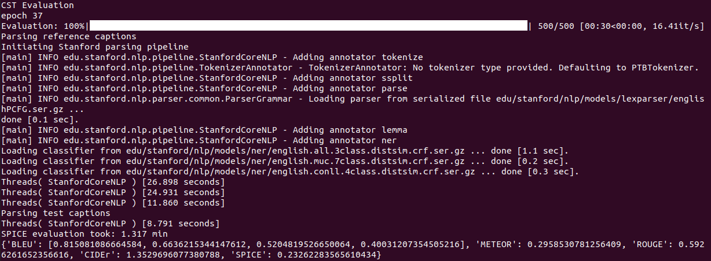
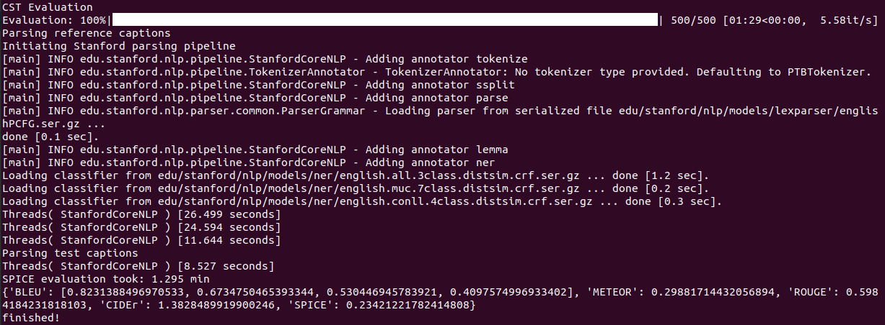
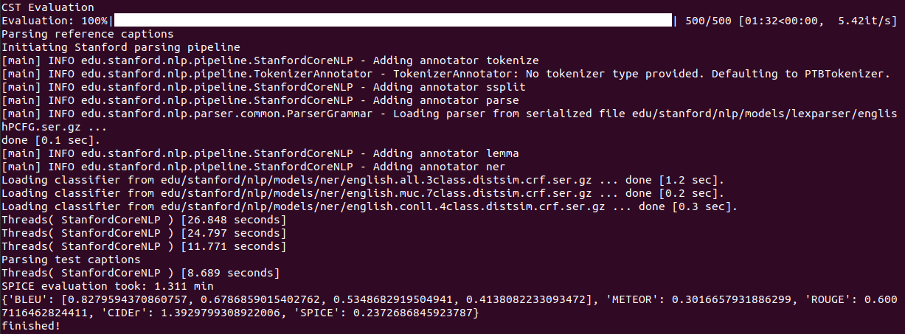

# Complementary Shifted Transformer for Image Captioning
This repository contains the reference code for the paper **"[Complementary Shifted Transformer for Image Captioning](https://link.springer.com/article/10.1007/s11063-023-11314-0)"**

***
## Getting Started
We use the following environment in our experiments. It's recommended to create a conda environment

+ CUDA 11.1
+ Python 3.6
+ PyTorch 1.8.0

Clone the repository and create the `CST` conda environment using the `environment.yml` file
```
conda env create -f environment.yml
conda activate CST
```

Please download the spacy models ([Github](https://github.com/explosion/spacy-models/releases/download/en_core_web_sm-3.2.0/en_core_web_sm-3.2.0.tar.gz)) and execute the following command in the conda environment
```commandline
pip install en_core_web_sm-3.2.0.tar.gz
```

***
## Preparing Data

* **Annotations**. Download the COCO annotation file [m2-annotation.zip](https://ailb-web.ing.unimore.it/publicfiles/drive/meshed-memory-transformer/annotations.zip) and the nocaps annotation file [nocaps-annotation](https://s3.amazonaws.com/nocaps/nocaps_val_image_info.json)
  
* **Features**. Download processed image features 
  - COCO: [COCO-ResNeXt](https://pan.baidu.com/s/1avz9zaQ7c36XfVFK3ZZZ5w) provided by [S2](https://github.com/zchoi/S2-Transformer) (code `9vtB`)
  - nocaps: [nocaps-ResNeXt](https://pan.baidu.com/s/1vox4f0CPSEDAFINYr1rLaQ) provided by ourselves (code `6j66`)

* **Pre-trained models**. Download our trained models [CST_XXX.pth](https://pan.baidu.com/s/1mY50Sm_4pBHD47BmlqX44g) (code `vhl2`)

Extract all the data and make sure you organize them as follows. Of course, you can also put annotations and features in the root directory for other models to use. The size of these files in the ubuntu system is displayed as follows


```
- CST
  | - checkpoints
  | - | - CST_X101.pth
  | - | - CST_X152.pth
  | - data
  | - ensemble_models
  | - images
  | - local
  |   | - annotations
  |   |   | - captions_train2014.jsoXn
  |   |   | - captions_val2014.json
  |   |   | - coco_train_ids.npy
  |   |   | - coco_dev_ids.npy
  |   |   | - coco_restval_ids.npy
  |   |   | - coco_test_ids.npy
  |   |   | - image_info_test2014.json
  |   |   | - nocaps_val_image_info.json
  |   | - features
  |   |   | - X101_grid_feats_coco_trainval.hdf5 (49.5G)
  |   |   | - X101_grid_feats_coco_test.hdf5     (16.4G)
  |   |   | - X101_grid_feats_nocaps_test.hdf5   (1.8G)
  |   |   | - X152_grid_feats_coco_trainval.hdf5 (49.5G)
  |   |   | - X152_grid_feats_coco_test.hdf5     (16.4G)
  |   |   | - X152_grid_feats_nocaps_test.hdf5   (1.8G)
  | - models
  | - offline_evaluation
  | - online_test
  | - tensorboard_logs
  | - utils
  | - environment.yml
  | - LICENSE
  | - README.md
  | - train.py
  | - vocab.pkl
```

***
## Training

Execute the following command to train our model
```
python train.py
```

***
## Offline Evaluation
Run `python eval.py` to evaluate our model (single model and ensemble model)


```
python eval.py
# cd offline_evaluation
# python ensemble_eval.py
# bash ensemble_eval.sh
```

For X101 feature, the result is as follows
```
{'BLEU': [0.815081086664584, 0.6636215344147612, 0.5204819526650064, 0.40031207354505216], 'METEOR': 0.2958530781256409, 'ROUGE': 0.5926261652356616, 'CIDEr': 1.3529696077380788, 'SPICE': 0.23262283565610434}
```


For X152 feature, the result is as follows
```
{'BLEU': [0.8191002432889197, 0.6669459388676849, 0.5229089701806792, 0.4024717018089491], 'METEOR': 0.2979335433407666, 'ROUGE': 0.5928667913961927, 'CIDEr': 1.3605548201907127, 'SPICE': 0.2343848307072949}
```


For ensemble models, you can run `python ensemble_eval.py` and get 





***
## Online Test
Execute the following command to do online test 

```
cd online_test
python test_online.py
# bash test_online.sh
```

For COCO dataset, you get two generated captions files (.json), named "captions_test2014_model_results.json" and "captions_val2014_model_results.json". **Compress** and **upload** it to [Codalab](https://codalab.lisn.upsaclay.fr/competitions/7404)

For nocaps dataset, you get one generated captions file (.json), named "captions_nocaps_val_model_results.json". **Upload** it to [Eval.ai](https://eval.ai/web/challenges/challenge-page/355) (Select Val Phase)

***
## Acknowledgements
Thank Cornia _et al._ [M2 Transformer](https://github.com/aimagelab/meshed-memory-transformer),
       Zhang _et al._ [RSTNet](https://github.com/zhangxuying1004/RSTNet),
       Luo _et al._ [DLCT](https://github.com/luo3300612/image-captioning-DLCT),
       Zeng _et al._ [S2 Transformer](https://github.com/zchoi/S2-Transformer),
       Hu _et al._ [PGT](https://github.com/TBI805/PGT),
       Ji _et al._ [MDSAN](https://github.com/Young499/image-captioning-MDSANet), and
       Ma _et al._ [LSTNet](https://github.com/xmu-xiaoma666/LSTNet) for their open source codes.
